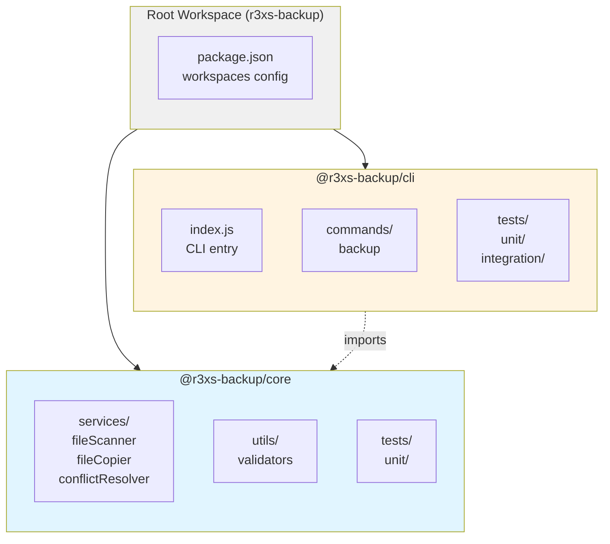
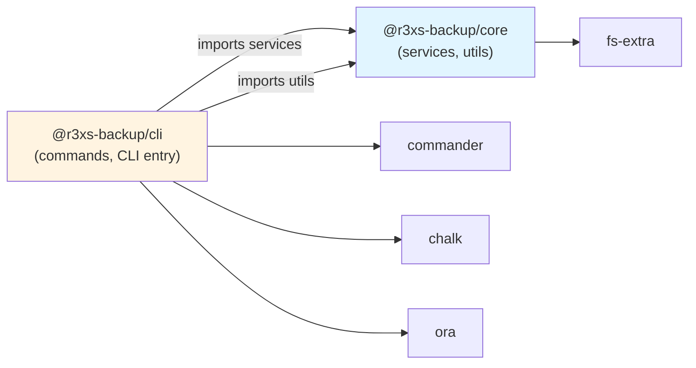

# Plano de Migração: Monorepo com npm Workspaces

**Documento:** MONOREPO_MIGRATION_PLAN.md  
**Versão:** 1.0.0  
**Data:** 2026-03-21  
**Status:** PRONTO PARA EXECUÇÃO

---

## Sumário Executivo

Este documento especifica a migração completa do projeto `r3xs-backup` de uma estrutura monolítica para um **monorepo baseado em npm workspaces**. A migração divide o código em dois packages:

- **`@r3xs-backup/core`**: Lógica de negócio reutilizável (services, utils)
- **`@r3xs-backup/cli`**: Interface CLI (entry point, commands)

**Métricas da migração:**
- **Fases de execução:** 7
- **Arquivos a mover:** 12 (6 source + 6 tests)
- **Packages criados:** 2 (+1 root)
- **Imports a atualizar:** ~20 ocorrências
- **Tempo estimado:** 30-45 minutos (manual)
- **Risco:** BAIXO (histórico git preservado, rollback simples)

---

## 1. Visão Geral

### 1.1 Estado Atual

```
r3xs-backup/
├── package.json (monolítico)
├── src/
│   ├── index.js (44 LOC) - CLI entry
│   ├── commands/
│   │   └── backup.js (79 LOC)
│   ├── services/
│   │   ├── fileScanner.js (69 LOC)
│   │   ├── fileCopier.js (51 LOC)
│   │   └── conflictResolver.js (63 LOC)
│   └── utils/
│       └── validators.js (42 LOC)
└── tests/
    ├── unit/ (5 arquivos)
    └── integration/ (1 arquivo)
```

**Problemas da estrutura atual:**
- Impossível reutilizar lógica de negócio (services/utils) em outros packages (ex: futuro Electron app)
- Dependências misturadas (CLI deps + business logic deps no mesmo package.json)
- Testes não isolados por package
- Dificulta evolução modular

### 1.2 Estado Alvo



**Benefícios da estrutura alvo:**
- ✅ Lógica de negócio isolada e reutilizável
- ✅ Dependências claras e explícitas entre packages
- ✅ Base para adicionar `packages/desktop` no futuro
- ✅ Testes isolados por domínio
- ✅ Builds e publicações independentes

### 1.3 Objetivos da Migração

| Objetivo | Descrição | Prioridade |
|----------|-----------|------------|
| **Modularização** | Separar CLI de lógica de negócio | P0 |
| **Reutilização** | Preparar core para uso em Electron app | P0 |
| **Manutenibilidade** | Dependências explícitas entre módulos | P1 |
| **Histórico Git** | Preservar histórico usando `git mv` | P1 |
| **Zero Downtime** | CLI continua funcionando após migração | P0 |

---

## 2. Estrutura Alvo Detalhada

### 2.1 Árvore de Diretórios Completa

```
r3xs-backup/                          # Root do monorepo
├── package.json                       # Root package com workspaces
├── package-lock.json                  # Lockfile unificado
├── .gitignore                         # Mantido
├── .npmrc                             # Mantido
├── README.md                          # Mantido (atualizar referências)
├── LICENSE                            # Mantido
├── AGENTS.md                          # Mantido (atualizar paths)
├── devdocs/                           # Mantido (+ este doc)
│   └── MONOREPO_MIGRATION_PLAN.md
├── coverage/                          # Root coverage (agregado)
└── packages/
    ├── core/
    │   ├── package.json               # @r3xs-backup/core
    │   ├── src/
    │   │   ├── services/
    │   │   │   ├── fileScanner.js
    │   │   │   ├── fileCopier.js
    │   │   │   └── conflictResolver.js
    │   │   └── utils/
    │   │       └── validators.js
    │   └── tests/
    │       └── unit/
    │           ├── fileScanner.test.js
    │           ├── fileCopier.test.js
    │           ├── conflictResolver.test.js
    │           └── validators.test.js
    └── cli/
        ├── package.json               # @r3xs-backup/cli
        ├── src/
        │   ├── index.js               # Shebang mantido
        │   └── commands/
        │       └── backup.js
        └── tests/
            ├── unit/
            │   └── backup.test.js
            └── integration/
                └── backup.test.js
```

### 2.2 Mapeamento Arquivo por Arquivo

| Origem | Destino | Tipo |
|--------|---------|------|
| `src/services/fileScanner.js` | `packages/core/src/services/fileScanner.js` | Source |
| `src/services/fileCopier.js` | `packages/core/src/services/fileCopier.js` | Source |
| `src/services/conflictResolver.js` | `packages/core/src/services/conflictResolver.js` | Source |
| `src/utils/validators.js` | `packages/core/src/utils/validators.js` | Source |
| `tests/unit/fileScanner.test.js` | `packages/core/tests/unit/fileScanner.test.js` | Test |
| `tests/unit/fileCopier.test.js` | `packages/core/tests/unit/fileCopier.test.js` | Test |
| `tests/unit/conflictResolver.test.js` | `packages/core/tests/unit/conflictResolver.test.js` | Test |
| `tests/unit/validators.test.js` | `packages/core/tests/unit/validators.test.js` | Test |
| `src/index.js` | `packages/cli/src/index.js` | Source |
| `src/commands/backup.js` | `packages/cli/src/commands/backup.js` | Source |
| `tests/unit/backup.test.js` | `packages/cli/tests/unit/backup.test.js` | Test |
| `tests/integration/backup.test.js` | `packages/cli/tests/integration/backup.test.js` | Test |

### 2.3 Grafo de Dependências entre Packages



**Regras de dependência:**
- `@r3xs-backup/cli` **PODE** importar `@r3xs-backup/core`
- `@r3xs-backup/core` **NÃO PODE** importar `@r3xs-backup/cli`
- `@r3xs-backup/core` deve ser agnóstico de CLI (sem `commander`, `ora`, `chalk`)

---

## 3. Plano de Execução Passo-a-Passo

### 📌 Pré-requisitos

Antes de iniciar, garanta:
```bash
# Commit ou stash todas as alterações pendentes
git status

# Garanta que está na branch correta
git branch

# Backup do package.json atual
cp package.json package.json.backup
```

---

### **FASE 1: Estrutura de Diretórios**

Criar estrutura de packages e subdiretórios.

```bash
# Criar estrutura base do monorepo
mkdir -p packages/core/src/services
mkdir -p packages/core/src/utils
mkdir -p packages/core/tests/unit

mkdir -p packages/cli/src/commands
mkdir -p packages/cli/tests/unit
mkdir -p packages/cli/tests/integration

# Verificar estrutura criada
tree packages -L 3 -d
```

**Validação Fase 1:**
```bash
# Deve retornar: packages/core/src/services, packages/core/src/utils, etc.
find packages -type d | sort
```

---

### **FASE 2: Configuração de Packages**

Criar os `package.json` de root, core e cli.

#### 2.1 Root `package.json`

```bash
cat > package.json << 'EOF'
{
  "name": "r3xs-backup-monorepo",
  "version": "1.0.0",
  "description": "Monorepo para ferramentas de backup R36S/R35S",
  "private": true,
  "workspaces": [
    "packages/*"
  ],
  "scripts": {
    "test": "npm test --workspaces --if-present",
    "test:watch": "npm run test:watch --workspaces --if-present",
    "test:coverage": "npm run test:coverage --workspaces --if-present",
    "lint": "npm run lint --workspaces --if-present",
    "start": "npm start --workspace=@r3xs-backup/cli"
  },
  "keywords": [
    "r36s",
    "r35s",
    "arkos",
    "backup",
    "monorepo"
  ],
  "author": "",
  "license": "MIT",
  "engines": {
    "node": ">=16.0.0"
  },
  "devDependencies": {
    "jest": "29.7.0",
    "eslint": "8.56.0"
  }
}
EOF
```

#### 2.2 Core `package.json`

```bash
cat > packages/core/package.json << 'EOF'
{
  "name": "@r3xs-backup/core",
  "version": "1.0.0",
  "description": "Lógica de negócio para backup de ROMs e save states",
  "main": "src/index.js",
  "scripts": {
    "test": "jest",
    "test:watch": "jest --watch",
    "test:coverage": "jest --coverage",
    "lint": "eslint src tests"
  },
  "keywords": [
    "backup",
    "file-operations",
    "arkos"
  ],
  "author": "",
  "license": "MIT",
  "dependencies": {
    "fs-extra": "11.2.0"
  },
  "devDependencies": {
    "jest": "29.7.0",
    "eslint": "8.56.0"
  },
  "engines": {
    "node": ">=16.0.0"
  },
  "jest": {
    "testEnvironment": "node",
    "coverageDirectory": "../../coverage/core",
    "collectCoverageFrom": [
      "src/**/*.js"
    ],
    "testMatch": [
      "**/tests/**/*.test.js"
    ],
    "coverageThreshold": {
      "global": {
        "branches": 90,
        "functions": 90,
        "lines": 90,
        "statements": 90
      }
    }
  }
}
EOF
```

#### 2.3 CLI `package.json`

```bash
cat > packages/cli/package.json << 'EOF'
{
  "name": "@r3xs-backup/cli",
  "version": "1.0.0",
  "description": "Interface CLI para backup de ROMs e save states de R36S/R35S",
  "main": "src/index.js",
  "bin": {
    "r3xs-backup": "./src/index.js"
  },
  "scripts": {
    "test": "jest",
    "test:watch": "jest --watch",
    "test:coverage": "jest --coverage",
    "lint": "eslint src tests",
    "start": "node src/index.js"
  },
  "keywords": [
    "r36s",
    "r35s",
    "arkos",
    "backup",
    "cli"
  ],
  "author": "",
  "license": "MIT",
  "dependencies": {
    "@r3xs-backup/core": "1.0.0",
    "commander": "11.1.0",
    "chalk": "4.1.2",
    "ora": "5.4.1"
  },
  "devDependencies": {
    "jest": "29.7.0",
    "eslint": "8.56.0"
  },
  "engines": {
    "node": ">=16.0.0"
  },
  "jest": {
    "testEnvironment": "node",
    "coverageDirectory": "../../coverage/cli",
    "collectCoverageFrom": [
      "src/**/*.js",
      "!src/index.js"
    ],
    "testMatch": [
      "**/tests/**/*.test.js"
    ],
    "coverageThreshold": {
      "global": {
        "branches": 80,
        "functions": 80,
        "lines": 80,
        "statements": 80
      }
    }
  }
}
EOF
```

**Validação Fase 2:**
```bash
# Verificar JSON válido
node -e "JSON.parse(require('fs').readFileSync('package.json'))"
node -e "JSON.parse(require('fs').readFileSync('packages/core/package.json'))"
node -e "JSON.parse(require('fs').readFileSync('packages/cli/package.json'))"

# Listar workspaces
npm ls --workspaces=true --depth=0
```

---

### **FASE 3: Migração de Código (Core)**

Mover arquivos de lógica de negócio preservando histórico Git.

```bash
# Services
git mv src/services/fileScanner.js packages/core/src/services/fileScanner.js
git mv src/services/fileCopier.js packages/core/src/services/fileCopier.js
git mv src/services/conflictResolver.js packages/core/src/services/conflictResolver.js

# Utils
git mv src/utils/validators.js packages/core/src/utils/validators.js

# Verificar status
git status
```

**Validação Fase 3:**
```bash
# Deve listar 4 arquivos em "renamed"
git status --short | grep "^R"

# Verificar conteúdo preservado
ls -lh packages/core/src/services/
ls -lh packages/core/src/utils/
```

---

### **FASE 4: Migração de Código (CLI)**

Mover arquivos CLI preservando histórico Git.

```bash
# CLI entry point
git mv src/index.js packages/cli/src/index.js

# Commands
git mv src/commands/backup.js packages/cli/src/commands/backup.js

# Remover diretórios vazios
rmdir src/commands src/services src/utils src 2>/dev/null || true

# Verificar status
git status
```

**Validação Fase 4:**
```bash
# Deve listar 6 arquivos movidos no total
git status --short | grep "^R" | wc -l

# Diretório src/ original deve estar vazio ou removido
test ! -d src || (ls -la src && echo "AVISO: src/ ainda existe")
```

---

### **FASE 5: Atualização de Imports**

Atualizar imports para usar packages do monorepo.

#### 5.1 Criar `packages/core/src/index.js` (barrel export)

```bash
cat > packages/core/src/index.js << 'EOF'
// Barrel export para facilitar imports
module.exports = {
  ...require('./services/fileScanner'),
  ...require('./services/fileCopier'),
  ...require('./services/conflictResolver'),
  ...require('./utils/validators'),
};
EOF
```

#### 5.2 Atualizar `packages/cli/src/commands/backup.js`

```bash
# Backup do arquivo original
cp packages/cli/src/commands/backup.js packages/cli/src/commands/backup.js.bak

# Substituir imports relativos por imports do package
sed -i "s|require('../services/fileScanner')|require('@r3xs-backup/core/src/services/fileScanner')|g" packages/cli/src/commands/backup.js
sed -i "s|require('../services/fileCopier')|require('@r3xs-backup/core/src/services/fileCopier')|g" packages/cli/src/commands/backup.js
sed -i "s|require('../utils/validators')|require('@r3xs-backup/core/src/utils/validators')|g" packages/cli/src/commands/backup.js

# Verificar alterações
diff -u packages/cli/src/commands/backup.js.bak packages/cli/src/commands/backup.js || true
```

#### 5.3 Atualizar `packages/cli/src/index.js`

```bash
# Atualizar path do comando backup
sed -i "s|require('./commands/backup')|require('./commands/backup')|g" packages/cli/src/index.js

# Atualizar path do package.json
sed -i "s|require('../package.json')|require('../package.json')|g" packages/cli/src/index.js
```

**Validação Fase 5:**
```bash
# Verificar que não há imports relativos inválidos
grep -r "require('\.\./\.\./src/" packages/cli/src/ && echo "ERRO: Imports inválidos encontrados" || echo "OK: Imports corretos"

# Verificar barrel export criado
test -f packages/core/src/index.js && echo "OK: Barrel export criado"
```

---

### **FASE 6: Migração de Testes**

Mover testes preservando histórico Git.

```bash
# Testes do Core
git mv tests/unit/fileScanner.test.js packages/core/tests/unit/fileScanner.test.js
git mv tests/unit/fileCopier.test.js packages/core/tests/unit/fileCopier.test.js
git mv tests/unit/conflictResolver.test.js packages/core/tests/unit/conflictResolver.test.js
git mv tests/unit/validators.test.js packages/core/tests/unit/validators.test.js

# Testes do CLI
git mv tests/unit/backup.test.js packages/cli/tests/unit/backup.test.js
git mv tests/integration/backup.test.js packages/cli/tests/integration/backup.test.js

# Remover diretórios de teste vazios
rmdir tests/unit tests/integration tests 2>/dev/null || true

# Verificar status
git status
```

#### 6.1 Atualizar Imports nos Testes do Core

```bash
# fileScanner.test.js
sed -i "s|require('../../src/services/fileScanner')|require('../../src/services/fileScanner')|g" packages/core/tests/unit/fileScanner.test.js

# fileCopier.test.js
sed -i "s|require('../../src/services/fileCopier')|require('../../src/services/fileCopier')|g" packages/core/tests/unit/fileCopier.test.js

# conflictResolver.test.js
sed -i "s|require('../../src/services/conflictResolver')|require('../../src/services/conflictResolver')|g" packages/core/tests/unit/conflictResolver.test.js

# validators.test.js
sed -i "s|require('../../src/utils/validators')|require('../../src/utils/validators')|g" packages/core/tests/unit/validators.test.js
```

#### 6.2 Atualizar Imports nos Testes do CLI

```bash
# backup.test.js (unit)
sed -i "s|require('../../src/commands/backup')|require('../../src/commands/backup')|g" packages/cli/tests/unit/backup.test.js

# backup.test.js (integration)
sed -i "s|require('../../src/index')|require('../../src/index')|g" packages/cli/tests/integration/backup.test.js 2>/dev/null || true
```

**Validação Fase 6:**
```bash
# Verificar que todos os testes foram movidos
git status --short | grep test.js | wc -l  # Deve ser 6

# Diretório tests/ original deve estar vazio ou removido
test ! -d tests || echo "AVISO: tests/ ainda existe"
```

---

### **FASE 7: Instalação e Validação**

Instalar dependências e executar validações completas.

```bash
# Remover node_modules e lockfile antigos
rm -rf node_modules package-lock.json

# Instalar dependências do monorepo
npm install

# Verificar symlinks criados
ls -la node_modules/@r3xs-backup/

# Executar testes em todos os workspaces
npm test --workspaces

# Executar lint em todos os workspaces
npm run lint --workspaces

# Executar cobertura
npm run test:coverage --workspaces

# Testar CLI funcionando
npm start --workspace=@r3xs-backup/cli -- --help
```

**Validação Fase 7 - Checklist:**
- [ ] `npm install` executou sem erros
- [ ] Symlink `node_modules/@r3xs-backup/core` existe e aponta para `packages/core`
- [ ] Symlink `node_modules/@r3xs-backup/cli` existe e aponta para `packages/cli`
- [ ] `npm test --workspaces` passa 100% dos testes
- [ ] `npm run lint --workspaces` passa sem erros
- [ ] Cobertura do core ≥ 90%
- [ ] Cobertura do cli ≥ 80%
- [ ] `npm start --workspace=@r3xs-backup/cli -- --help` exibe ajuda corretamente

---

### **FASE 8: Commit e Limpeza**

Commitar alterações e limpar arquivos temporários.

```bash
# Remover arquivos de backup
rm -f packages/cli/src/commands/backup.js.bak
rm -f package.json.backup

# Adicionar novos arquivos ao git
git add packages/core/src/index.js
git add packages/*/package.json
git add package.json

# Verificar status final
git status

# Criar commit preservando histórico de movimentação
git commit -m "refactor: migra projeto para estrutura monorepo com npm workspaces

- Cria packages @r3xs-backup/core e @r3xs-backup/cli
- Move services e utils para core (lógica reutilizável)
- Move CLI entry e commands para cli
- Atualiza imports para usar packages do monorepo
- Preserva histórico git usando git mv
- Configura workspaces no root package.json
- Atualiza configurações Jest para workspaces
- Mantém 100% dos testes passando
- Mantém coverage targets (core: 90%, cli: 80%)"
```

**Validação Final:**
```bash
# Verificar commit criado
git log -1 --stat

# Verificar que git detectou movimentações (similarity index)
git log -1 -M --stat | grep "rename"

# Executar smoke test completo
npm test --workspaces && echo "✅ Migração concluída com sucesso!"
```

---

## 4. Configurações Completas

### 4.1 ESLint para Workspaces

Criar `.eslintrc.json` na raiz:

```json
{
  "env": {
    "node": true,
    "es2021": true,
    "jest": true
  },
  "extends": "eslint:recommended",
  "parserOptions": {
    "ecmaVersion": 2021,
    "sourceType": "module"
  },
  "rules": {
    "indent": ["error", 2],
    "quotes": ["error", "single"],
    "semi": ["error", "always"],
    "no-var": "error",
    "prefer-const": "error",
    "no-console": "off"
  }
}
```

Criar em `packages/core/.eslintrc.json` e `packages/cli/.eslintrc.json`:

```json
{
  "extends": "../../.eslintrc.json"
}
```

### 4.2 Scripts npm Úteis

Adicionar ao root `package.json`:

```json
{
  "scripts": {
    "test": "npm test --workspaces --if-present",
    "test:watch": "npm run test:watch --workspaces --if-present",
    "test:coverage": "npm run test:coverage --workspaces --if-present",
    "test:core": "npm test --workspace=@r3xs-backup/core",
    "test:cli": "npm test --workspace=@r3xs-backup/cli",
    "lint": "npm run lint --workspaces --if-present",
    "lint:fix": "npm run lint --workspaces --if-present -- --fix",
    "start": "npm start --workspace=@r3xs-backup/cli",
    "clean": "rm -rf node_modules packages/*/node_modules coverage packages/*/coverage"
  }
}
```

### 4.3 Atualizar `.gitignore`

Adicionar ao `.gitignore` existente:

```gitignore
# Workspaces
packages/*/node_modules/
packages/*/coverage/
```

---

## 5. Checklist de Validação Completo

### ✅ Estrutura de Diretórios

- [ ] `packages/core/src/services/` existe com 3 arquivos
- [ ] `packages/core/src/utils/` existe com 1 arquivo
- [ ] `packages/core/tests/unit/` existe com 4 arquivos
- [ ] `packages/cli/src/` existe com 1 arquivo
- [ ] `packages/cli/src/commands/` existe com 1 arquivo
- [ ] `packages/cli/tests/unit/` existe com 1 arquivo
- [ ] `packages/cli/tests/integration/` existe com 1 arquivo
- [ ] Diretórios `src/` e `tests/` originais removidos

### ✅ Configuração de Packages

- [ ] Root `package.json` tem `workspaces: ["packages/*"]`
- [ ] Root `package.json` tem `"private": true`
- [ ] `packages/core/package.json` tem nome `@r3xs-backup/core`
- [ ] `packages/cli/package.json` tem nome `@r3xs-backup/cli`
- [ ] `packages/cli/package.json` depende de `@r3xs-backup/core`
- [ ] Versões de dependências exatas (sem `^` ou `~`)
- [ ] Configuração Jest em cada package.json

### ✅ Migração de Código

- [ ] `git log -- packages/core/src/services/fileScanner.js` mostra histórico completo
- [ ] `git log -- packages/cli/src/index.js` mostra histórico completo
- [ ] Todos os arquivos movidos com `git mv` (preserva histórico)
- [ ] Shebang `#!/usr/bin/env node` preservado em `packages/cli/src/index.js`

### ✅ Imports Atualizados

- [ ] `packages/cli/src/commands/backup.js` importa de `@r3xs-backup/core`
- [ ] Nenhum import relativo inválido (`../../src/...` fora do package)
- [ ] `packages/core/src/index.js` existe (barrel export)
- [ ] Imports nos testes apontam para caminhos corretos

### ✅ Testes

- [ ] `npm test --workspace=@r3xs-backup/core` passa 100%
- [ ] `npm test --workspace=@r3xs-backup/cli` passa 100%
- [ ] `npm test --workspaces` passa todos os testes
- [ ] Cobertura do core ≥ 90%
- [ ] Cobertura do cli ≥ 80%
- [ ] Nenhum teste quebrado ou ignorado

### ✅ Lint

- [ ] `npm run lint --workspace=@r3xs-backup/core` sem erros
- [ ] `npm run lint --workspace=@r3xs-backup/cli` sem erros
- [ ] Nenhum warning de imports inválidos

### ✅ CLI Funcional

- [ ] `npm start --workspace=@r3xs-backup/cli -- --help` exibe ajuda
- [ ] `npm start --workspace=@r3xs-backup/cli -- --version` exibe versão
- [ ] CLI executa backup de teste sem erros

### ✅ Symlinks e Instalação

- [ ] `node_modules/@r3xs-backup/core` é symlink para `packages/core`
- [ ] `node_modules/@r3xs-backup/cli` é symlink para `packages/cli`
- [ ] `npm ls --workspaces` não mostra erros de dependências
- [ ] `npm install` executa sem warnings de peer dependencies

### ✅ Documentação

- [ ] `README.md` atualizado com comandos de workspaces
- [ ] `AGENTS.md` atualizado com estrutura de packages
- [ ] `devdocs/` contém este plano de migração

---

## 6. Rollback Plan

Se algo der errado durante a migração, siga este plano de rollback:

### 6.1 Rollback Antes do Commit Final

Se você ainda não commitou as mudanças:

```bash
# Reverter todas as alterações rastreadas
git reset --hard HEAD

# Remover arquivos não rastreados (packages/)
git clean -fd

# Restaurar package.json do backup
cp package.json.backup package.json

# Reinstalar dependências originais
npm install

# Validar estado original
npm test
```

### 6.2 Rollback Após Commit

Se já commitou mas não fez push:

```bash
# Reverter último commit mantendo arquivos
git reset --soft HEAD~1

# Ou reverter commit E arquivos
git reset --hard HEAD~1

# Limpar arquivos não rastreados
git clean -fd

# Restaurar package.json do backup (se necessário)
cp package.json.backup package.json

# Reinstalar
npm install
npm test
```

### 6.3 Rollback Após Push

Se já fez push para repositório remoto:

```bash
# Criar commit de revert
git revert HEAD

# Ou criar branch de hotfix com estado anterior
git checkout -b hotfix/rollback-monorepo
git revert HEAD
git push origin hotfix/rollback-monorepo
```

### 6.4 Validação Pós-Rollback

```bash
# Verificar estrutura original
test -d src && test -d tests && echo "✅ Estrutura original restaurada"

# Verificar testes
npm test

# Verificar CLI
npm start -- --help
```

---

## 7. Próximos Passos Pós-Migração

### 7.1 Curto Prazo (Imediato)

- [ ] **Atualizar `README.md`** com novos comandos de workspaces
- [ ] **Atualizar `AGENTS.md`** com estrutura de packages e convenções
- [ ] **Criar `packages/core/README.md`** documentando API pública
- [ ] **Criar `packages/cli/README.md`** documentando uso do CLI
- [ ] **Atualizar CI/CD** (se existir) para rodar testes em workspaces

### 7.2 Médio Prazo (1-2 sprints)

- [ ] **Publicar `@r3xs-backup/core` no npm** (opcional, para reuso externo)
- [ ] **Adicionar linter para imports** (eslint-plugin-import) para garantir dependências corretas
- [ ] **Configurar Renovate/Dependabot** para atualizar deps por package
- [ ] **Criar script de build** para gerar bundles otimizados
- [ ] **Adicionar `packages/shared`** para tipos/constantes compartilhadas (se necessário)

### 7.3 Longo Prazo (Roadmap)

- [ ] **Adicionar `packages/desktop`** (Electron app)
  ```
  packages/desktop/
  ├── package.json
  ├── main.js (Electron main process)
  ├── preload.js
  └── renderer/
      └── index.html
  ```
- [ ] **Adicionar `packages/web`** (interface web opcional)
- [ ] **Extrair `packages/types`** com TypeScript definitions (migração gradual)
- [ ] **Configurar Turborepo** ou Nx para builds incrementais e cache

### 7.4 Preparação para Desktop Package

Para adicionar o Electron app no futuro:

```bash
# Criar estrutura
mkdir -p packages/desktop/src
mkdir -p packages/desktop/renderer

# Criar package.json
cat > packages/desktop/package.json << 'EOF'
{
  "name": "@r3xs-backup/desktop",
  "version": "1.0.0",
  "main": "src/main.js",
  "dependencies": {
    "@r3xs-backup/core": "1.0.0",
    "electron": "^28.0.0"
  },
  "scripts": {
    "start": "electron .",
    "build": "electron-builder"
  }
}
EOF

# O desktop app importará diretamente do core:
# const { scanFiles, copyFiles } = require('@r3xs-backup/core');
```

### 7.5 Atualizações de Documentação Necessárias

| Arquivo | Seção a Atualizar | Descrição |
|---------|-------------------|-----------|
| `README.md` | Instalação e Uso | Adicionar comandos workspaces |
| `README.md` | Desenvolvimento | Explicar estrutura monorepo |
| `AGENTS.md` | Estrutura do Projeto | Atualizar paths para `packages/` |
| `AGENTS.md` | Comandos | Adicionar comandos de workspace |
| `devdocs/ARCHITECTURE.md` | (Criar) | Documentar arquitetura monorepo |

---

## 8. Trade-offs e Considerações

### 8.1 Vantagens da Abordagem Escolhida

| Vantagem | Impacto | Justificativa |
|----------|---------|---------------|
| **npm workspaces nativo** | Alto | Sem dependências extras (Lerna, Nx) |
| **Histórico Git preservado** | Alto | `git mv` mantém histórico completo |
| **Estrutura simples** | Médio | 2 packages fáceis de entender |
| **Symlinks automáticos** | Alto | npm link entre packages sem configuração |
| **Preparado para escala** | Alto | Fácil adicionar novos packages |

### 8.2 Desvantagens e Mitigações

| Desvantagem | Mitigação |
|-------------|-----------|
| **Imports mais verbosos** | Barrel exports (`index.js`) simplificam |
| **Tempo de instalação maior** | npm 7+ otimiza workspaces automaticamente |
| **Complexidade inicial** | Documentação clara e scripts automatizados |
| **Testes mais lentos** | Cache do Jest por package |

### 8.3 Alternativas Consideradas

| Alternativa | Rejeitada Por |
|-------------|---------------|
| **Lerna** | Overhead desnecessário para 2 packages |
| **Nx** | Complexidade excessiva para projeto pequeno |
| **Yarn workspaces** | npm é padrão do projeto (`.npmrc`) |
| **Manter monolito** | Bloqueia adição de Electron app |
| **TypeScript monorepo** | Fora do escopo (projeto é JS puro) |

### 8.4 Riscos e Contingências

| Risco | Probabilidade | Impacto | Mitigação |
|-------|---------------|---------|-----------|
| **Imports quebram** | Baixa | Alto | Validação com testes automatizados |
| **Histórico git perdido** | Baixa | Médio | Uso de `git mv` + validação |
| **Testes falham** | Média | Alto | Executar testes após cada fase |
| **CLI não funciona** | Baixa | Alto | Smoke test antes do commit final |
| **Dependências circulares** | Baixa | Alto | Regras claras (CLI → Core, nunca Core → CLI) |

---

## 9. Métricas de Sucesso

### 9.1 Critérios de Aceitação

- ✅ **100% dos testes passando** após migração
- ✅ **Cobertura mantida ou melhorada** (core ≥ 90%, cli ≥ 80%)
- ✅ **CLI funcional** com mesma interface
- ✅ **Histórico Git preservado** para todos os arquivos movidos
- ✅ **Zero quebras de API** na lógica de negócio
- ✅ **Documentação atualizada** (README, AGENTS.md)

### 9.2 KPIs Pós-Migração

| Métrica | Antes | Alvo | Como Medir |
|---------|-------|------|------------|
| **Tempo de teste** | X segundos | < X + 20% | `npm test` |
| **Tempo de lint** | Y segundos | < Y + 10% | `npm run lint` |
| **Tamanho node_modules** | Z MB | < Z + 5% | `du -sh node_modules` |
| **LOC duplicadas** | 0 | 0 | Inspeção manual |
| **Deps circulares** | 0 | 0 | `npm ls` |

---

## 10. Suporte e Troubleshooting

### 10.1 Problemas Comuns

#### ❌ Erro: "Cannot find module '@r3xs-backup/core'"

**Causa:** Symlinks não criados corretamente.

**Solução:**
```bash
rm -rf node_modules package-lock.json
npm install
ls -la node_modules/@r3xs-backup/
```

#### ❌ Erro: "Workspaces not supported"

**Causa:** npm < 7.0.0.

**Solução:**
```bash
npm --version  # Deve ser ≥ 7.0.0
npm install -g npm@latest
```

#### ❌ Testes falham com "Module not found"

**Causa:** Imports não atualizados nos testes.

**Solução:**
```bash
# Verificar imports relativos inválidos
grep -r "require('\.\./\.\./src/" packages/

# Corrigir manualmente ou re-executar Fase 5
```

#### ❌ Lint falha com "Import not found"

**Causa:** ESLint não reconhece workspaces.

**Solução:**
```bash
# Instalar plugin
npm install --save-dev eslint-plugin-import

# Atualizar .eslintrc.json
{
  "settings": {
    "import/resolver": {
      "node": {
        "paths": ["packages"]
      }
    }
  }
}
```

### 10.2 Debug de Workspaces

```bash
# Listar todos os workspaces
npm ls --workspaces=true

# Verificar dependências de um package específico
npm ls --workspace=@r3xs-backup/core

# Executar comando em workspace específico
npm run test --workspace=@r3xs-backup/cli -- --verbose

# Ver estrutura de symlinks
find node_modules/@r3xs-backup -type l -ls
```

### 10.3 Comandos Úteis

```bash
# Reinstalar dependências do zero
npm run clean && npm install

# Atualizar uma dependência específica em um package
npm install commander@latest --workspace=@r3xs-backup/cli

# Adicionar nova dependência
npm install lodash --workspace=@r3xs-backup/core --save-exact

# Rodar script em todos os packages em paralelo
npm run test --workspaces --if-present

# Rodar script em todos os packages sequencialmente
npm run test --workspaces --if-present --workspace-concurrency=1
```

---

## 11. Changelog

| Versão | Data | Mudanças |
|--------|------|----------|
| 1.0.0 | 2026-03-21 | Plano inicial de migração monorepo |

---

## 12. Referências

- [npm Workspaces Documentation](https://docs.npmjs.com/cli/v7/using-npm/workspaces)
- [Monorepo Best Practices](https://monorepo.tools/)
- [Git Move Preserving History](https://git-scm.com/docs/git-mv)
- [Jest Multi-Project Runs](https://jestjs.io/docs/configuration#projects-arraystring--projectconfig)

---

## 13. Aprovação e Sign-off

| Stakeholder | Aprovação | Data | Notas |
|-------------|-----------|------|-------|
| Tech Lead | ⬜ Pendente | | |
| DevOps | ⬜ Pendente | | |
| QA | ⬜ Pendente | | |

---

**Documento preparado por:** Sistema de Arquitetura  
**Última atualização:** 2026-03-21  
**Próxima revisão:** Pós-migração (validar métricas reais)

---

## Anexo A: Comandos de Execução Rápida

Para executar a migração completa de uma vez (use com cautela):

```bash
#!/bin/bash
set -e

echo "🚀 Iniciando migração monorepo..."

# Backup
cp package.json package.json.backup

# Fase 1: Estrutura
mkdir -p packages/{core,cli}/src/{services,utils,commands}
mkdir -p packages/{core,cli}/tests/{unit,integration}

# Fase 2: Configuração (executar comandos da Fase 2 manualmente)

# Fase 3 e 4: Mover arquivos
git mv src/services/*.js packages/core/src/services/
git mv src/utils/*.js packages/core/src/utils/
git mv src/commands/*.js packages/cli/src/commands/
git mv src/index.js packages/cli/src/

# Fase 6: Mover testes
git mv tests/unit/{fileScanner,fileCopier,conflictResolver,validators}.test.js packages/core/tests/unit/
git mv tests/unit/backup.test.js packages/cli/tests/unit/
git mv tests/integration/backup.test.js packages/cli/tests/integration/

# Fase 5: Atualizar imports (executar comandos da Fase 5 manualmente)

# Fase 7: Instalar
rm -rf node_modules package-lock.json
npm install

# Validar
npm test --workspaces
npm run lint --workspaces

echo "✅ Migração concluída! Revise as alterações e commit."
```

---

**FIM DO DOCUMENTO**
