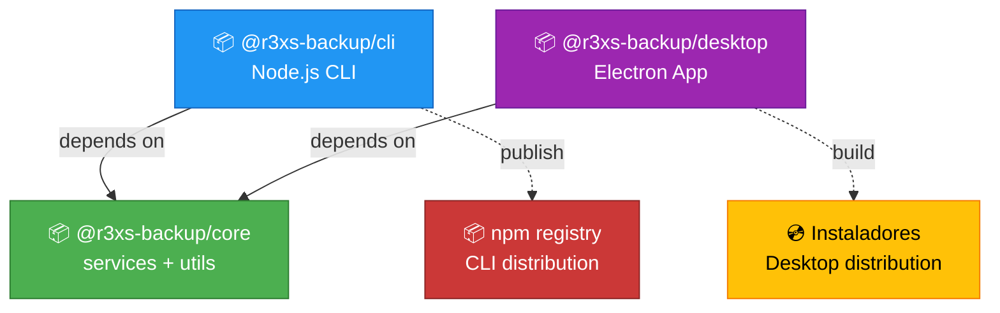

# ADR-003: Monorepo Structure with npm Workspaces

**Status:** Aceito  
**Data:** 2026-03-21  
**Decisores:** Time de desenvolvimento  

## Contexto

O projeto r3xs-backup está evoluindo de uma ferramenta CLI simples (~348 LOC, 6 arquivos) para incluir uma interface desktop com Electron. Precisamos definir a estrutura de organização do código que permita:

1. **Compartilhar lógica** entre CLI e Desktop (services, utils)
2. **Distribuir independentemente** CLI (npm) e Desktop (instaladores)
3. **Manter simplicidade** proporcional ao tamanho do projeto (3 packages)
4. **Facilitar testes isolados** por contexto (core, cli, desktop)

### Estrutura Atual
```
src/
├── index.js              (CLI entry point)
├── commands/
│   └── backup.js
├── services/
│   ├── fileScanner.js
│   ├── fileCopier.js
│   └── conflictResolver.js
└── utils/
    └── validators.js
```

### Estrutura Alvo
```
packages/
├── core/               # Lógica compartilhada
│   ├── services/       (fileScanner, fileCopier, conflictResolver)
│   └── utils/          (validators)
├── cli/                # CLI existente
│   ├── index.js
│   └── commands/
└── desktop/            # Electron app
    ├── main/           (Electron main process)
    ├── renderer/       (UI)
    └── preload/        (Bridge)
```

### Dependency Graph


## Decisão

Adotamos **npm workspaces nativos** para estruturar o projeto como monorepo com 3 packages:

- **`@r3xs-backup/core`**: Lógica de negócio compartilhada
- **`@r3xs-backup/cli`**: CLI Node.js (depende de `core`)
- **`@r3xs-backup/desktop`**: Electron app (depende de `core`)

### Configuração
```json
// package.json (root)
{
  "name": "r3xs-backup-monorepo",
  "private": true,
  "workspaces": [
    "packages/*"
  ],
  "scripts": {
    "test": "npm run test --workspaces",
    "lint": "npm run lint --workspaces",
    "build:cli": "npm run build --workspace=@r3xs-backup/cli",
    "build:desktop": "npm run build --workspace=@r3xs-backup/desktop"
  }
}
```

```json
// packages/cli/package.json
{
  "name": "@r3xs-backup/cli",
  "dependencies": {
    "@r3xs-backup/core": "*"
  }
}
```

## Alternativas Consideradas

### Alt 1: Monorepo com Nx
**Descrição:** Usar Nx Monorepo com dependency graph, caching e affected commands.

**Prós:**
- Cache inteligente de builds e testes
- Dependency graph automático
- Affected commands (`nx affected:test`)
- Plugins oficiais para Electron e Node.js

**Contras:**
- **Overhead massivo** para 3 packages simples
- Setup complexo
- `nx.json`, `workspace.json`, plugins extras
- Curva de aprendizado íngreme para contribuidores

**Rejeitada porque:**
- Ferramentas enterprise para problema small-scale
- Custo de manutenção > benefício para equipe pequena

### Alt 2: Monolito Modular
**Descrição:** Manter tudo em um único package com subpastas `src/core/`, `src/cli/`, `src/desktop/`.

**Prós:**
- Zero configuração adicional
- Sem complexidade de workspaces
- Testes unificados

**Contras:**
- **Impossível distribuir CLI e Desktop separadamente**
- Dependências misturadas (Electron deps poluem CLI)
- Sem isolamento de testes (desktop tests rodam com CLI tests)
- Dificulta publicação futura do `core` como biblioteca

**Rejeitada porque:**
- Viola requisito de distribuição independente
- Escala mal quando desktop crescer

### Alt 3: Repositórios Separados
**Descrição:** 3 repos: `r3xs-backup-core`, `r3xs-backup-cli`, `r3xs-backup-desktop`.

**Prós:**
- Isolamento total
- Versionamento independente via semver

**Contras:**
- **Overhead de sincronização** entre repos
- Desenvolver feature que toca core + cli requer 2 PRs
- CI/CD mais complexo (3 pipelines)
- Dificulta refactorings cross-package

**Rejeitada porque:**
- Fragmentação excessiva para projeto small-to-medium

## Razões da Decisão

### npm Workspaces
**Prós:**
1. **Zero overhead:** Built-in no npm 7+, sem dependências extras
2. **Simplicidade:** Apenas `"workspaces": ["packages/*"]` no root
3. **Shared dependencies:** `node_modules` hoisted na raiz
4. **Comandos nativos:** `npm run test --workspaces` roda testes de todos os packages
5. **Versionamento independente:** Cada package tem seu próprio `version`
6. **Evolutivo:** Migração futura para Nx possível se necessário

**Contras:**
1. **Sem cache de builds/testes:** Cada `npm test` roda tudo
2. **Dependency graph manual:** Sem análise automática de affected packages
3. **Scripts customizados:** `--workspace` flags manuais para comandos por package

**Decisão:** Os prós superam os contras para nosso contexto (3 packages, equipe pequena, projeto em crescimento).

## Consequências

### Positivas
- ✅ **Reutilização:** CLI e Desktop compartilham `core` via `dependencies`
- ✅ **Distribuição:** `npm publish @r3xs-backup/cli` separado de instaladores desktop
- ✅ **Testes isolados:** `npm test --workspace=@r3xs-backup/core` roda apenas testes core
- ✅ **Manutenção simples:** Contributors familiares com npm não precisam aprender Nx
- ✅ **Publicação futura:** `core` pode virar lib pública sem refactor

### Negativas
- ❌ **Sem affected commands:** Mudança em `core` requer rodar testes de `cli` e `desktop` manualmente
  - **Mitigação:** CI sempre roda `npm test --workspaces` (testa tudo)
- ❌ **Sem cache:** Testes não cacheable localmente
  - **Mitigação:** Testes rápidos (~2-3s total hoje), cacheable em CI via GitHub Actions
- ❌ **Dependency graph manual:** Desenvolvedores devem saber que `cli` → `core`
  - **Mitigação:** Documentar em `DEVELOPERS_GUIDE.md` e `PROJECT_STRUCTURE.md`

### Neutras
- ⚖️ **Curva de aprendizado:** Baixa - workspaces são conceito simples
- ⚖️ **Lock files:** `package-lock.json` único na raiz (comportamento padrão)

## Estrutura de Migração

### Fase 1: Setup Monorepo
```bash
# 1. Criar estrutura
mkdir -p packages/{core,cli,desktop}

# 2. Mover código existente
mv src/services packages/core/
mv src/utils packages/core/
mv src/{index.js,commands} packages/cli/src/

# 3. Configurar package.json's
# root: "workspaces": ["packages/*"]
# cli: dependencies: {"@r3xs-backup/core": "*"}

# 4. Reinstalar deps
npm install
```

### Fase 2: Scaffold Desktop
```bash
cd packages/desktop
npm init -y
npm install electron --save-dev
```

### Fase 3: Ajustar CI
```yaml
# .github/workflows/ci.yml
- run: npm install
- run: npm run lint --workspaces
- run: npm run test --workspaces
```

## Scripts Essenciais

```json
// package.json (root)
{
  "scripts": {
    "test": "npm run test --workspaces --if-present",
    "test:core": "npm test --workspace=@r3xs-backup/core",
    "test:cli": "npm test --workspace=@r3xs-backup/cli",
    "test:desktop": "npm test --workspace=@r3xs-backup/desktop",
    "lint": "npm run lint --workspaces --if-present",
    "build": "npm run build --workspaces --if-present"
  }
}
```

## Evolução Futura

### Se o projeto crescer (>10 packages ou >5 devs):
- **Considerar Nx:** Cache e affected commands justificáveis
- **Migração:** `npx nx@latest init` converte workspaces automaticamente

### Se precisar publicar packages:
```bash
npm publish --workspace=@r3xs-backup/core
npm publish --workspace=@r3xs-backup/cli
```

## Notas

- **Hoisting:** `node_modules` compartilhado na raiz reduz duplicação
- **Private packages:** `core` pode ficar `"private": true` se não for publicar
- **Symlinks:** npm cria symlinks automáticos entre packages (`packages/cli/node_modules/@r3xs-backup/core` → `../../core`)
- **Compatibilidade:** Requer npm ≥7.0.0 (Node.js ≥16 já atende)

## Referências

- [npm Workspaces Docs](https://docs.npmjs.com/cli/v10/using-npm/workspaces)
- [npm Workspaces Guide](https://docs.npmjs.com/cli/v10/configuring-npm/package-json#workspaces)
- [Monorepo Tools Comparison](https://monorepo.tools/)
- [Nx vs npm workspaces](https://nx.dev/concepts/integrated-vs-package-based)
